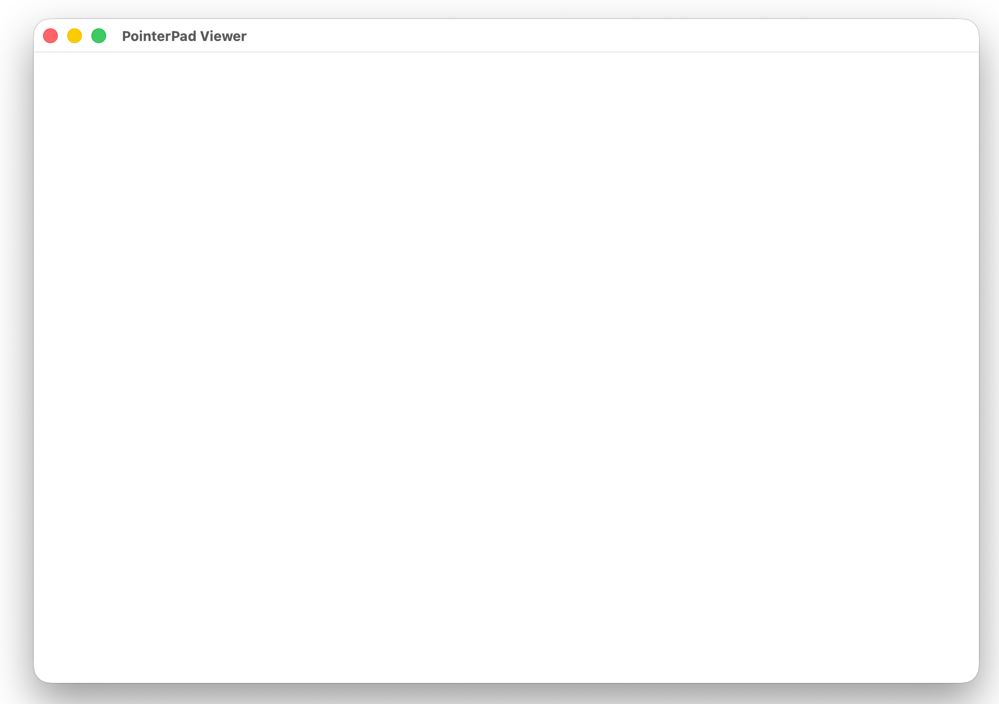
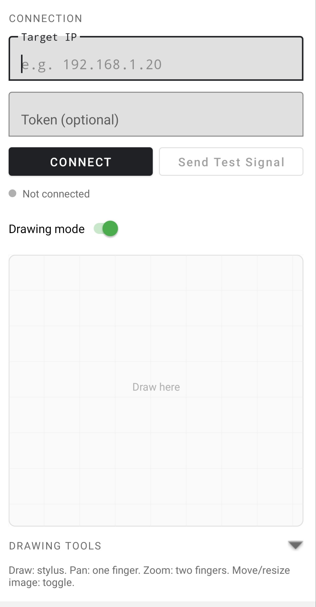
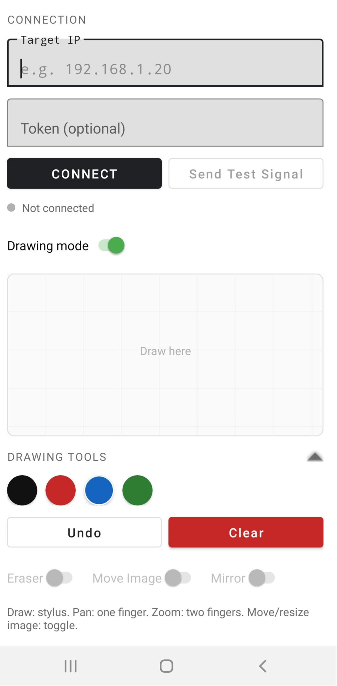

# PresentationMouse / PointerPad

This repo contains a minimal two-part app to use an Android phone (including S Pen) as a wireless mouse/trackpad and drawing tablet for macOS.

## What you get
- Android app (`android/`) that sends pointer/mouse events and drawing strokes over Wi‑Fi.
- macOS UDP server + viewer (`mac/MacPointerServer/`) that receives events, drives the macOS cursor, and shows a live drawing window.

## How to run

### 1) macOS server + viewer
1. Open a terminal in `mac/MacPointerServer`.
2. Run:
   ```bash
   swift run MacPointerServer --port 50505 --token YOUR_TOKEN
   ```
3. When prompted, grant Accessibility permissions so it can control the mouse:
   System Settings → Privacy & Security → Accessibility → enable the server app/terminal.
4. Find your Mac’s IP address (example):
   ```bash
   ipconfig getifaddr en0
   ```

### 2) Android app
1. Open `android/` in Android Studio.
2. If Android Studio prompts to create a Gradle wrapper, accept.
3. Build + run on your Note 9.
4. Enter the Mac IP and the same token, then tap Connect.

### 2b) Android app (command line)
You need JDK 17, Android SDK command‑line tools (including `sdkmanager`), and `adb`.

1. Install the SDK tools and set `ANDROID_SDK_ROOT` to your SDK path.
2. Install required SDK packages:
   ```bash
   sdkmanager "platform-tools" "platforms;android-34" "build-tools;34.0.0"
   ```
3. Install Gradle and generate a wrapper in `android/`:
   ```bash
   cd android
   gradle wrapper
   ```
4. Build and install to your phone:
   ```bash
   ./gradlew :app:assembleDebug
   adb install -r app/build/outputs/apk/debug/app-debug.apk
   ```

## Gestures (Mouse mode)
- Single finger: move cursor
- Tap: left click
- Long press: drag
- Two fingers: scroll (vertical)
- Two‑finger tap: right click
- Stylus drag mode (toggle in app): hover to move, pen down = drag/draw

## Drawing mode
- Draw directly on the phone; the Mac viewer mirrors strokes in real time.
- Colors: Black, Red, Blue, Green
- Undo / Clear supported
- One finger pan + two-finger zoom for infinite canvas
- Eraser: toggle in app or hold the S Pen button while drawing
- Move/Resize Image: toggle in app to reposition and resize pasted images (drag the corner handle)
- Optional: “Mirror to apps” sends strokes as mouse drag events so you can draw inside other apps too.

## Image paste (Mac → Phone)
- In the Mac viewer window, press `Cmd+V` to paste an image.
- The image appears in the Mac viewer and is sent to the phone.
- Images are resized for faster transfer and can be moved/resized on either device.

## macOS viewer example
<p align="center">
  
</p>

## Android app example
<p align="center">
  
  
</p>

## Notes
- Both devices must be on the same Wi‑Fi network.
- This is best‑effort UDP (no encryption). Use a token to reduce accidental input.
- Stylus pressure/tilt is not transmitted; it behaves like a mouse drag.
- The Android image receiver caps incoming images at 10 MB for safety.

## macOS server options
- `--port 50505`
- `--token YOUR_TOKEN`
- `--sensitivity 1.2`
- `--verbose` (enable packet logging)
- `--warp` (use cursor warping, can fix ghost cursor)
- `--invert-y` (invert vertical movement)
- `--image-port 50506` (TCP port for pasted images)
- `--image-max 1600` (max image dimension before resize)
- `--control-port 50507` (UDP control port for image move/resize sync)

Environment variable fallback:
- `POINTER_TOKEN`
